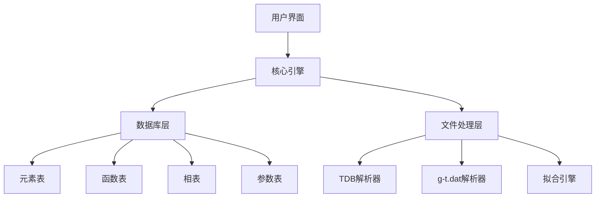
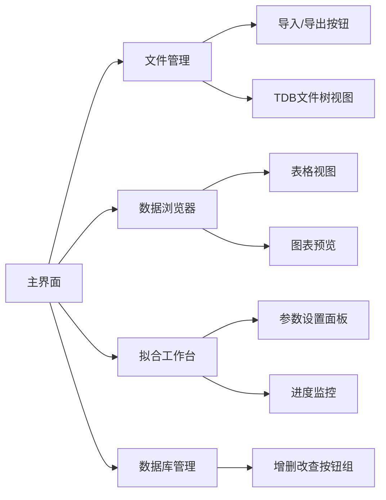
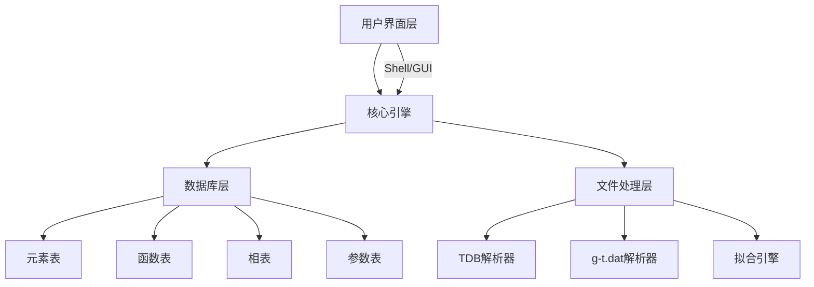

# 开发文档：TDB数据库管理系统

---

## 总览

---

### 一、概述

本系统旨在提供一个集数据管理、格式转换、自动化处理于一体的TDB文件开发工具，支持：

- 数据库增删改查（CRUD）
- TDB文件导入/导出
- Gibbs-Temperature数据（g-t.dat）导入与拟合
- 遵循TDB格式规范（行长限制、注释符等）

---

### 二、功能需求

| 模块          | 功能描述                                                                                     |
|---------------|---------------------------------------------------------------------------------------------|
| **数据管理**   | - 元素（ELEMENT）管理<br>- 热力学函数（FUNCTION）管理<br>- 相（PHASE）管理<br>- 参数（PARAMETER）管理 |
| **导入导出**   | - 从TDB文件导入<br>- 导出为TDB文件<br>- 从g-t.dat文件导入拟合数据                           |
| **工具**       | - Gibbs拟合（复用现有算法）<br>- 格式校验（行长、注释符）<br>- 版本控制（记录修改历史）        |
| **UI/CLI**     | - 命令行交互（基础版）<br>- 可选图形界面（未来扩展）                                        |

---

### 三、系统架构



---

### 四、数据库设计

**仅供参考，以之后的详细设计实现为准。**

#### 1. 表结构设计

| 表名          | 字段说明                                                                 |
|---------------|-------------------------------------------------------------------------|
| **elements**  | name, ref_state, atomic_mass, h298_h0, s298, tdb_name                   |
| **functions** | name, temp_start, temp_end, expression, is_continued, tdb_name          |
| **phases**    | name, sub_lattices, stoichiometry, components, tdb_name                 |
| **parameters**| type, phase, components, order, temp_start, temp_end, expression, is_continued, tdb_name |
| **tdb_files** | name, description, update_time                                          |

#### 2. 关键约束

- **主键**：`name`
- **外键关联**：`functions.tdb_name` → `tdb_files.name`
- **唯一性**：`elements.name` + `tdb_files.name` 必须唯一
- **表达式格式**：字段`expression`需符合TDB语法（如`+A*T*LN(T)`）

---

### 五、核心接口设计

**仅供参考，以之后的详细设计实现为准。**

#### 1. 数据导入接口

```python
def import_tdb(file_path: str, tdb_name: int) -> bool:
    """解析TDB文件并存入数据库"""
    # 实现逻辑：逐行解析，识别关键字（ELEMENT/FUNCTION等）
    
def import_gibbs_data(file_path: str, structure: str) -> FitResult:
    """导入g-t.dat并自动拟合，返回拟合参数"""
    # 复用现有gibbs_fit.py的拟合逻辑
```

#### 2. 数据导出接口

```python
def export_tdb(tdb_name: int, output_path: str) -> None:
    """按TDB格式规范导出文件"""
    # 生成顺序：ELEMENT → FUNCTION → PHASE → PARAMETER → OPTIMIZATION
    # 注意：每行不超过80字符，自动换行
```

---

### 六、开发计划

| 阶段       | 任务清单                                        | 预计周期 |
|------------|------------------------------------------------|---------|
| **阶段1**  | 完成数据库模型设计与基础CRUD接口开发              | 2周     |
| **阶段2**  | 实现TDB文件解析器与导出器（支持基本元素/函数/相）  | 3周     |
| **阶段3**  | 集成g-t.dat导入功能，复用拟合算法并存储参数       | 2周     |
| **阶段4**  | 开发命令行工具，完成单元测试与格式校验            | 1周     |

---

### 七、风险与解决方案

| 风险点                  | 解决方案                                                             |
|-------------------------|---------------------------------------------------------------------|
| **复杂表达式解析**       | 使用正则表达式匹配TDB语法，结合AST解析器处理数学表达式                  |
| **多版本TDB兼容性**      | 通过`tdb_files.version`字段区分版本，设计向下兼容的解析逻辑            |
| **性能瓶颈（大数据量）** | 对查询操作添加缓存层，使用数据库索引优化高频查询（如`elements.name`）   |

---

### 八、技术选型建议

| 组件          | 推荐方案                  | 备选方案                  |
|---------------|---------------------------|---------------------------|
| 数据库        | SQLite（轻量级）          | PostgreSQL（企业级）      |
| 解析引擎      | 自研解析器（Python）       | ANTLR语法分析器           |
| 命令行工具    | Click框架                 | 自定义argparse            |
| 单元测试      | pytest + pytest-mock      | unittest                  |

---

### 九、示例开发流程

```bash
# 导入现有TDB文件
$ tdb-manager import tdb my_database.tdb

# 查看元素列表
$ tdb-manager list elements

# 从g-t.dat生成参数
$ tdb-manager fit ./gibbs-temperature.dat --structure FCC

# 导出为新TDB文件
$ tdb-manager export my_database --output new.tdb
```

---

### 十、下一步行动

1. 完成数据库模型设计与迁移脚本
2. 开发TDB解析器核心模块
3. 集成现有拟合算法到导入流程
4. 编写单元测试用例（参考`gibbs_fit.py`的测试数据）

---

## 数据库模型设计

要求：包括elements、fuctions、phases、parameters、tdb_files等表,尽量不设置id字段等精简表设计的思路

1. elements表定义元素，是全局不重复的
2. functions表定义函数，即单质的函数，是全局不重复的，本项目目前不写后续温度区间，故function.is_continued为N
  本项目中functions.expression为`A+B*T+C*T*LN(T)+D*T**2+E*T**3+F/T`
3. phases表定义相，明确子晶格数量和计量比(sum==1)，子晶格允许出现的元素（可能要elements约束）
4. parameters表明确了G的相、各子晶格元素组成及表达式
  parameters.expression与functions.expression类似，但本项目的这里引用了phases.stoichiometry和functions.name(如`A+B*T+C*T*LN(T)+D*T**2+E*T**3+F/T+ph_sto1*func_elem1+ph_sto2*func_elem2`, ph_sto为子晶格计量比，func_elem为子晶格元素对应的functions.name)
5. tdbs表定义tdb文件，包含版本号、描述等（可能单个相为一个文件？项目想从原有的2子晶格扩展成3子晶格，这样相和端基表达式（即parameter）的数目会变多，目前还不知道哪里不兼容需要做文件隔离）

**关于.tdb文件的一些规定约束的文字表述**
tdb.tdb文件包括多个elements、functions、phases、parameters，他们的名字在tdb内唯一不能重复
不同的.tdb的elements和functions是相同的指向全局的elements和functions（这个用触发器做同步），
不同的.tdb可以有同名的phase，他们的components不同
不同的.tdb不可能有同名的parameters，因为parameter.phase外键关联phases.phase，parameter.components与phases.components相关（存在关联但不是简单的引用）

sqlite数据类型是动态的，但希望静态设计，同时考虑空间限制，使用满足条件的最小数据类型，

---

### 数据库核心职责

数据库仅负责结构化数据存储，以下逻辑、约束、校验由应用层代码实现：

待补充

---

### 表关系设计

```erDiagram
    tdb_files ||--o{ phases : "包含"
    tdb_files ||--o{ parameters : "包含"
    tdb_files ||--o{ elements : "引用全局元素"
    tdb_files ||--o{ functions : "引用全局函数"

    elements ||--o{ functions : "定义函数"
    phases ||--o{ parameters : "拥有参数"

    tdb_files {
      TEXT tdb PK
      TEXT description
      TEXT version
      TIMESTAMP update_time
    }
    
    elements {
      TEXT elem PK
      TEXT ref_state
      REAL atomic_mass
      REAL h298_h0
      REAL s298
    }
    
    functions {
      TEXT func PK
      TEXT elem FK
      REAL temp_start
      REAL temp_end
      TEXT expression
      TEXT is_continued
    }
    
    phases {
      TEXT phase
      INTEGER sub_lattices
      TEXT stoichiometry
      TEXT components
      TEXT tdb FK
      PK phase, tdb  // 同一TDB内phase名称唯一
      FK tdb -> tdb_files.tdb
    }
    
    parameters {
      TEXT params
      TEXT type
      TEXT phase
      TEXT components
      INTEGER order
      REAL temp_start
      REAL temp_end
      TEXT expression
      TEXT is_continued
      TEXT tdb FK
      PK params, tdb  // 同一TDB内params名称唯一
      FK phase, tdb -> phases.phase, phases.tdb
      FK tdb -> tdb_files.tdb
    }
```

1. 全局表：elements、functions
2. tdbs一对多->phases、parameters
3. tdbs与全局表：tdbs引用的全局表由应用层同步

### 表字段设计

#### 1. elements 表（元素管理）

| 字段名           | 类型   | 说明                                                  |
|------------------|--------|------------------------------------------------------|
| `elem`           | TEXT   | 主键，元素名称（如CU、MG）                            |
| `ref_state`      | TEXT   | 参考状态（如FCC_A1、VACUUM）                          |
| `atomic_mass`    | REAL   | 原子质量（单位：g/mol）                               |
| `h298_h0`        | REAL   | 标准生成焓（单位：J/mol）                             |
| `s298`           | REAL   | 标准熵（单位：J/(mol·K)）                             |

#### 2. functions 表（热力学函数）

| 字段名           | 类型   | 说明                                                  |
|------------------|--------|------------------------------------------------------|
| `func`           | TEXT   | 主键，函数名称（如GHSERCU）                            |
| `elem`           | TEXT   | 元素名称（如CU、MG）                                  |
| `temp_start`     | REAL   | 温度范围起始值（单位：K）                              |
| `temp_end`       | REAL   | 温度范围结束值（单位：K）                              |
| `expression`     | TEXT   | 数学表达式（如`A+B*T+C*T*LN(T)+D*T**2+E*T**3+F/T`）   |
| `is_continued`   | TEXT   | 是否有后续温度区间（Y/N）                             |
| FK | FOREIGN KEY `(elem)` | 外键，引用elements表的主键elem字段                    |

#### 3. tdbs 表（TDB文件元数据）

| 字段名           | 类型   | 说明                            |
|------------------|--------|--------------------------------|
| `tdb`            | TEXT   | 主键，文件名称（如`Cu-Mg.tdb`） |
| `description`    | TEXT   | 文件描述（如"Cu-Mg二元体系"）   |
| `version`        | TEXT   | 版本号（如"1.0"）              |
| `update_time`    | TIMESTAMP | 更新时间                    |

#### 4. phases 表（相管理）

| 字段名           | 类型   | 说明                                       |
|------------------|--------|------------------------------------------|
| `phase`          | TEXT   | 相名称（如LIQUID、HCP_A3）                 |
| `sub_lattices`   | INTEGER| 子晶格数量（如2）                          |
| `stoichiometry`  | TEXT   | 化学计量比（如`1.0 0.5`，空格分隔）         |
| `components`     | TEXT   | 各子晶格组成（如`:CU,MG% : VA :`，冒号分隔）|
| `tdb`            | TEXT   | 所属TDB文件名                              |
| PK       | PRIMARY KEY `(name, tdb)` | 主键，同一TDB内phase名唯一      |
| FK | FOREIGN KEY `(tdb)` REFERENCES `tdbs(tdb)` | 外键约束          |

#### 5. parameters 表（参数管理）

| 字段名           | 类型   | 说明                                        |
|------------------|--------|--------------------------------------------|
| `params`         | TEXT   | 参数名称（如G(FCC,CU,MG%:VA;0)）            |
| `type`           | TEXT   | 参数类型（如`G`、`L`）                      |
| `phase`          | TEXT   | 参数所属相（如`FCC`）                       |
| `components`     | TEXT   | 参数各子晶格组成（如`CU,MG%:VA`）            |
| `order`          | INTEGER| Redlich-Kister阶数（如0）                   |
| `temp_start`     | REAL   | 温度范围起始值（单位：K）                    |
| `temp_end`       | REAL   | 温度范围结束值（单位：K）                    |
| `expression`     | TEXT   | 数学表达式（如`A+B*T+ph_sto1*func_elem1`）  |
| `is_continued`   | TEXT   | 是否有后续温度区间（Y/N）                    |
| `tdb`            | TEXT   | 所属TDB文件名                               |
| PK | PRIMARY KEY `(params, tdb)` | 主键，同一TDB内params名唯一          |
| FK | FOREIGN KEY `(phase, tdb)` REFERENCES `phases(phase, tdb)` | 外键约束 |
| FK | FOREIGN KEY `(tdb)` REFERENCES `tdbs(tdb)` | 外键约束 |

---

## 核心代码功能设计

### 一、数据库类设计

```python
# 数据库连接管理与crud操作
class ThermoDB
  conn  # 数据库连接对象
  cursor  # 数据库游标对象
  def __init__(self, db_path):
    # 初始化数据库连接和游标
    pass
  # crud elements
  # ...
  # crud functions
  # ...
  # crud tdbs，级联删除tdb下的phases、parameters
  # ...
  # crud phases
  # ...
  # crud parameters
  # ...
  # query phases, 查询指定tdb的phases
  # query parameters, 查询指定tdb的parameters
```

### 二、.tdb文件管理器类设计

```python
# .tdb文件解析并存入数据库，数据库导出为.tdb文件
# 依赖ThermoDB实例
class TdbManager:
  map = { }# 行解析函数映射表
  def __init__(self, db):
    # 初始化ThermoDB实例
    pass
  def _parse_elem(self, line):
    # 解析ELEMENT行，存入db
    pass
  def _parse_func(self, line):
    # 解析FUNCTION行，存入db
    pass
  def _parse_phase(self, line, tdb):
    # 解析PHASE/CONSTITUENT行，存入db
    pass
  def _parse_param(self, line, tdb):
    # 解析PARAMETER行，存入db
    pass
  def _export_elements(self, file):
    # 全局elements写入
    pass
  def _export_functions(self, file):
    # 全局functions写入
    pass
  def _export_phases(self, file, tdb):
    # tdb相关phases写入
    pass
  def _export_parameters(self, file, tdb):
    # tdb相关parameters写入
    pass
  def parse_tdb(self, tdb_path, desc, v):
    # 主函数，正确解析.tdb文件，存入数据库
    pass
  def export_tdb(self, tdb_path, tdb):
    # 主函数，正确格式导出.tdb文件
    pass
```

### 三、G_T拟合集成设计

```python
class FitResult(TypedDict):

class GTFitter:
    def __init__(self):
        # 初始化拟合公式
        self.formula = "+A+B*T+C*T*LN(T)+D*T**2+E*T**3+F*T**(-1)"
    
    def process_folders(self, directory: str, atom_num: int = 0):
        """处理目录中的Gibbs-Temperature数据文件夹
       
        Args:
            directory (str): 包含数据文件的目录路径
            atom_num (int): 原子数量，默认为0表示自动检测
            
        Returns:
            list[FitResult]: 拟合结果列表
        """
        pass

    def plot_fits(self, fit_results: list[FitResult], output: str):
        """将拟合结果绘制为图表并保存
        
        Args:
            fit_results (list[FitResult]): 拟合结果列表
            output (str): 输出图像文件路径
        """
        pass
    
    def fit2db(self, fit_results: list[FitResult], phase: str, tdb: str):
        """将拟合结果转换为数据库对象
        
        Args:
            fit_results (list[FitResult]): 拟合结果列表
            phase (str): 相名称
            tdb (str): TDB文件名
            
        Returns:
            ParsedData: 可导入数据库的解析数据对象
        """
        pass
```

### 四、用户界面设计

#### 1. Shell交互式界面（增强型CLI）

**设计目标**：提供交互式命令行体验，支持上下文感知和命令补全。

**功能特性**：

- **命令补全**：支持Tab键自动补全命令、参数和数据库对象名称
- **上下文模式**：进入不同操作模式（如`tdb>`, `fit>`）简化操作
- **历史记录**：支持命令历史回溯和重用
- **多线程支持**：长操作（如拟合）可后台执行并显示进度

用户通过dbi的crud方法获取数据库数据 如 elements/functions/tdb/phases/params，具体看dbi对各表的grud方法
用户选择数据库tdb名和输出路径执行 export_tdb()
3. 用户选择路径执行 parse_tdb() 解析.tdb文件 获得 elements/functions/tdb/phases/params 等数据
在3 的数据基础上用户可按需选择是否保留旧的数据执行 save_elements()/save_functions() 保存elements/functions
在3 的数据基础上用户执行 import_tdb()保存tdb名关联的tdb/phases/params数据至数据库
用户选择路径执行 process_folders() 遍历文件夹下所有数据文件夹，解析出拟合数据fit_results
在fit_results数据基础上用户可执行 plot_fits() 绘制拟合结果图
在fit_results数据基础上用户可输入 tdb名 执行 fit2db() 将拟合结果fit_results转为tdb/phases/params数据
在fit_results数据基础上用户可选择 import_tdb() 保存tdb名关联的tdb/phases/params数据至数据库

**示例交互流程**：

```bash
$ python main.py
tdb> fit ./gibbs-data FCC Cu-Mg.tdb
tdb> save elements
tdb> save functions
tdb> import Cu-Mg.tdb

# 或者批量处理整个系统
tdb> fits ./system-data Cu-Mg.tdb
tdb> save elements
tdb> save functions
tdb> import Cu-Mg.tdb
```

**技术选型**：

| 组件          | 推荐方案               | 优势                  |
|---------------|------------------------|----------------------|
| Shell框架     | Python `cmd`模块 + `prompt_toolkit` | 丰富的交互功能       |
| 命令解析      | 自定义语法解析器       | 支持复杂参数组合     |
| 进度显示      | `tqdm`库集成          | 可视化操作进度       |

---

#### 2. 图形界面（GUI）设计方案

**设计目标**：提供直观的可视化操作界面，支持多任务并行处理。

**核心功能模块**：



**关键界面设计**：

1. **主界面**：
   - 顶部工具栏：文件、编辑、视图等菜单
   - 左侧导航树：显示TDB文件/元素/相/参数层级结构
   - 中央工作区：Tab页切换不同功能模块

2. **拟合工作台**：
   - 数据导入：拖拽文件或目录
   - 参数设置：交互式表达式编辑器
   - 实时预览：拟合曲线与原始数据对比
   - 批量处理：多文件并行处理队列

3. **数据库浏览器**：
   - 表格视图：支持过滤、排序、列选择
   - 关联导航：点击元素名称可跳转到相关函数
   - 版本对比：并排查看不同TDB版本差异

**技术选型**：

| 组件          | 推荐方案               | 优势                  |
|---------------|------------------------|----------------------|
| GUI框架       | PyQt5/PySide6          | 跨平台、功能丰富      |
| 数据可视化    | Matplotlib + PyQt图表集成 | 高质量科学绘图       |
| 并发处理      | QThread + 信号槽机制   | 主线程不阻塞         |

---

### 五、系统架构更新



---

### 六、开发计划调整

| 阶段       | 新增任务项                                  | 预计周期 |
|------------|--------------------------------------------|----------|
| **阶段5**  | Shell交互式命令行开发                       | 1.5周    |
| **阶段6**  | 基础图形界面原型开发（元素/相管理）          | 2周      |
| **阶段7**  | 完成图形界面拟合/导出功能                   | 2.5周    |
| **阶段8**  | 界面测试与用户体验优化                      | 1周      |

---

### 七、技术选型补充

| 组件          | 推荐方案               | 优势                  | 备选方案               |
|---------------|------------------------|-----------------------|-----------------------|
| Shell框架     | prompt_toolkit         | 支持语法高亮和多线程  | click + cmd模块        |
| 图形界面      | PyQt5                  | 成熟的GUI框架         | Tkinter（简单快速）    |
| 界面-引擎通信 | 内部API封装            | 高效直接调用          | REST API（适合分布式） |

---

### 八、风险与解决方案更新

| 新增风险点                  | 解决方案                                      |
|----------------------------|----------------------------------------------|
| **GUI性能瓶颈**            | 采用异步操作和缓存机制，关键组件使用C扩展      |
| **多界面维护成本**          | 通过抽象接口层统一后端逻辑，前端仅作调用      |
| **用户操作复杂度**          | 提供向导模式和快捷操作模板，增加帮助文档      |

---

### 九、示例开发流程（GUI）

```bash
# 启动图形界面
$ tdb-manager gui

# 图形界面操作流程：
1. 主界面左侧导航树展开"Cu-Mg.tdb"节点
2. 右键"Cu-Mg.tdb"选择"导入TDB文件"
3. 在"拟合工作台"标签页拖入"gibbs-temperature.dat"
4. 设置参数后点击"开始拟合"按钮
5. 在"数据库管理"标签页点击"保存到新TDB"生成Cu-Mg-v2.tdb
```

---

### 十、数据库交互改进

为支持界面快速响应，新增以下优化：

```python
# 在ThermoDBI中增加异步查询接口
async def async_query(self, table: str, queries: dict):
    # 使用线程池执行阻塞IO操作
    with concurrent.futures.ThreadPoolExecutor() as pool:
        return await asyncio.get_event_loop().run_in_executor(pool, self._read, table, queries)
```

---

### 十一、界面交互设计原则

1. **一致性**：命令参数与GUI控件保持命名和逻辑一致
2. **反馈机制**：所有操作需有明确进度提示（如拟合进度条）
3. **错误处理**：采用对话框提示代替命令行报错，提供修复建议
4. **快捷入口**：常用操作（如导入/导出）设置快捷键（如Ctrl+I）

---

### 单元测试类

待补充

### 异常类
